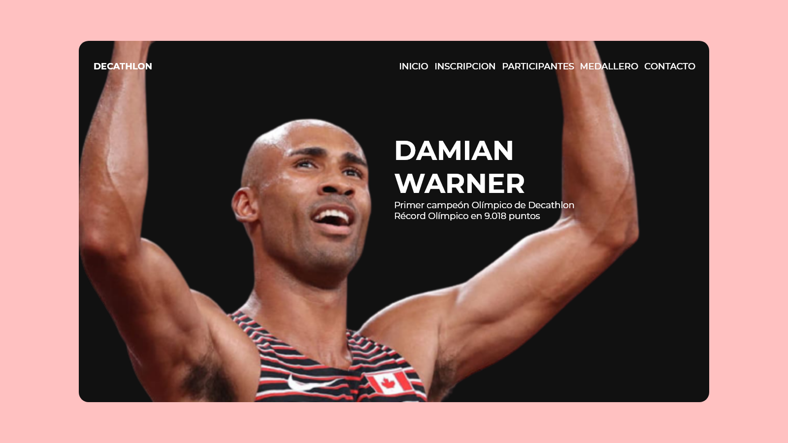

# Proyecto Final Codo a Codo 4.0

Grimoldi, Joaquín

## Decathlon - Damian Warner

Esta página es una presentacion final integrando todos los conceptos aprendidos en el curso. La página web busca simular una competencia donde los participantes deberán registrarse completando un formulario. Esto sera con el fin de luego mostrarlos en un listado.
Las tecnologías utilizadas para su desarrollo son algunas de las aprendidas a lo largo del curso, en este caso HTML, CSS, FlexBox, JavaScript y PHP

---

## Características de la Web

## Generales

+ main-color: **#111111**

+ run-discipline: **#802316**

+ throw-discipline: **#467879**

+ jump-discipline: **#BD8D3E**

+ font-family: **Montserrat, Athletic, FontAwesome**

+ font-color-white: **#ffffff**

+ font-color-black: **#111111**

+ font-color-mute: **#C3C3C3**

+ font-weight-h1: **700**, font-weight-button: **700**

+ font-weight-header: **500**

+ font-weight-p: **400**, font-weight-label: **400**, font-weight-input: **400**

+ font-weight-footer: **300**, font-weight-placeholder: **300**

### Mobile

+ font-size-h1: **38px**

+ font-size-h2: **35px**

+ font-size-h3: **25px**

+ font-size-logo: **16px**

+ font-size-a: **16px**

+ font-size-p: **16px**

+ font-size-input: **16px**

+ font-size-button: **16px**

+ font-size-social: **25px**

+ font-size-footer: **14px**

### Desktop

+ font-size-h1: **55px**

+ font-size-h2: **50px**

+ font-size-h3: **30px**

+ font-size-logo: **18px**

+ font-size-a: **18px**

+ font-size-p: **18px**

+ font-size-input: **18px**

+ font-size-button: **18px**

+ font-size-social: **25px**

+ font-size-footer: **16px**
